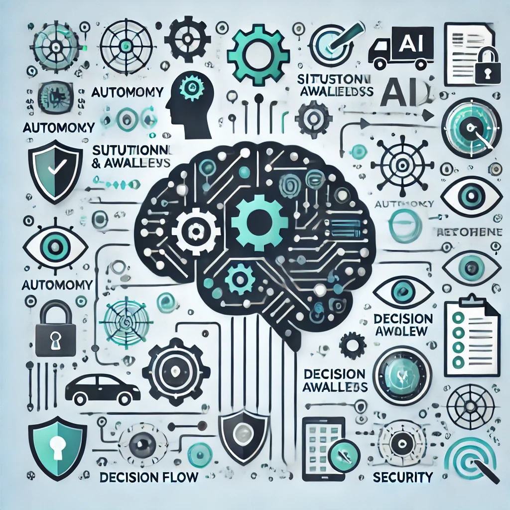
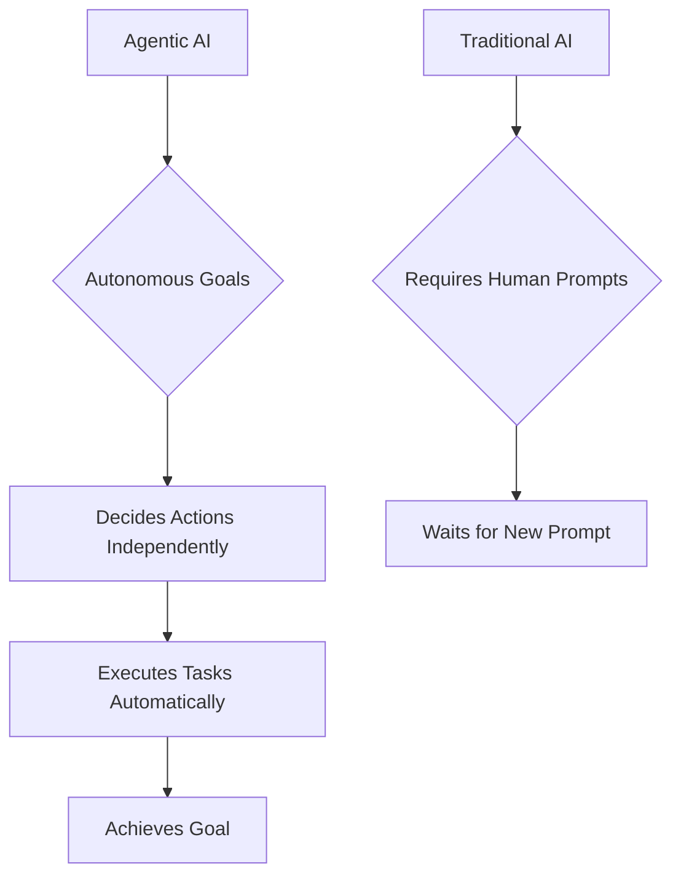
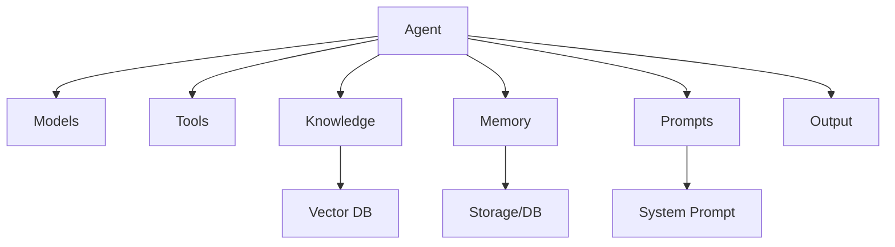
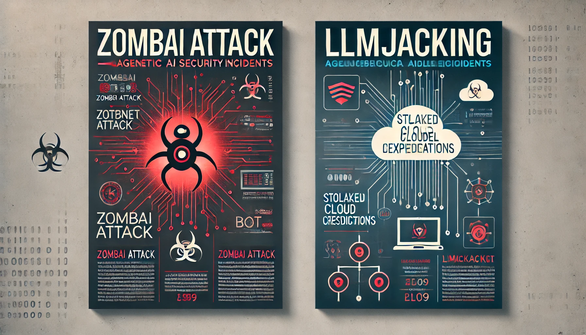

# AI Agentic Security: Securing the Future of Autonomous Intelligence

## 🚀  The Rise of AI Agents: Unleashing Transformative Power

Imagine intelligent agents tirelessly making decisions, executing tasks, and solving problems—even while you sleep. This is not science fiction; it's the promise of agentic AI. Unlike traditional AI, which needs explicit prompts for every action, agentic AI possesses the power of autonomy, enabling it to set goals, make decisions, and take actions independently. These agents, combining AI techniques such as machine learning, reinforcement learning, natural language processing, and computer vision with memory, planning, and powerful tools, represent a revolutionary leap forward in artificial intelligence.

The transformative potential of AI agents lies in their dynamic interaction with their environments to achieve goals. They can operate autonomously, semi-autonomously, or as part of multiagent systems, taking complex actions that were previously impossible without human intervention. Imagine systems that do more than assist—they proactively anticipate and respond to needs, reshaping decision-making, enhancing situational awareness, and boosting productivity by taking on labor-intensive tasks.

### 💻 Real-Life Examples

- **Customer Service**: AI agents like chatbots and virtual assistants are reducing customer response times by up to 70%, significantly improving customer satisfaction and reducing the workload for human agents. [Source: Gartner, 2024](https://www.gartner.com/document/5816515)
- **Supply Chain Management**: Companies like Amazon use AI agents to automate inventory management and logistics, resulting in a 75% faster delivery times and a 25% reduction in processing times. [Source: Sifted, 2024](https://sifted.com/resources/how-amazon-is-using-ai-to-become-the-fastest-supply-chain-in-the-world/)
- **Healthcare**: Autonomous AI systems in hospitals help monitor patient vitals and predict medical emergencies, leading to a 40% improvement in patient outcomes and reducing the workload on medical staff. [Source: Walkingtree, 2024](https://walkingtree.tech/ai-agents-healthcare/)

### 📊 Quantitative Benefits

- By 2028, agentic AI is expected to contribute to a **25% boost in productivity** across industries adopting these technologies.  [Source: McKinsey,2024](https://www.mckinsey.com/capabilities/quantumblack/our-insights/the-state-of-ai)
- In code development, AI agents have already started writing up to  **25% code** at companies like google.  [Source: Forbes,2024](https://www.forbes.com/sites/jackkelly/2024/11/01/ai-code-and-the-future-of-software-engineers/)
- In financial services, AI agents have reduced the time required for fraud detection by **50%**, helping save millions in potential losses.  [Source: McKinsey,2024](https://www.mckinsey.com/capabilities/quantumblack/our-insights/the-state-of-ai)

### 📈 Bold Predictions

- By 2030, **50% of all customer interactions** in service sectors will be handled by AI agents, drastically changing how businesses engage with their customers. [Source: Forrester Research, 2024](https://www.forrester.com/)
- **75% of operational tasks** within logistics companies will be fully automated by AI agents by 2030, creating a new standard for efficiency in the industry.

By 2028, agentic AI will be an integral part of enterprise software. It will revolutionize everything from customer service to operational decision-making and significantly increase productivity across countless sectors.

### 🤖  Primer on Agentic AI

#### Visualizing Agentic AI

The visuals included in this blog aim to simplify and illustrate the profound concepts of agentic AI, showcasing its evolution from traditional AI to fully autonomous systems. The flow diagram of agentic AI versus traditional AI highlights how agentic AI redefines independence, acting without the need for continuous human intervention. Pictograms provide real-world examples of AI agents enhancing industries like healthcare, supply chain, and customer service. Additionally, charts and tables emphasize the tangible benefits and emerging threats, giving readers a deeper understanding of the critical need for robust security measures. These visuals collectively bring clarity to the multifaceted landscape of agentic AI—its power, promise, and the responsibilities it demands.

#### Components of Agent

Agentic AI agents are composed of several essential components that work together to achieve autonomy and efficiency. Each component serves a distinct function, enabling the agent to act intelligently, make informed decisions, and interact effectively with its environment.

- **Models**: These are the underlying AI models (LLM, SLM and others), including machine learning algorithms and neural networks that help the agent learn from data and make decisions.

- **Tools**: AI agents are equipped with various tools that provide additional capabilities, such as accessing APIs, performing specialized calculations, or interfacing with hardware.

- **Knowledge**: Agents draw from knowledge sources like a Vector Database (Vector DB) to store and retrieve information efficiently, which enhances decision-making and situational awareness.

- **Memory**: The memory of an agent is crucial for storing past interactions and learned information. It involves storage or databases that allow the agent to recall and use previous experiences in future tasks.

- **Agent Prompts**: Agent Prompts provide the agent with instructions on how to act. This includes a system prompt that comprises guidelines and instructions governing its behavior.

- **Output**: This is the final action or decision made by the agent, which can be a response, an action taken in the environment, or a generated solution.

Together, these components empower agents to act autonomously, learn over time, and optimize their operations for the tasks at hand.

#### Types of Agents and Their Working Mechanisms

Agentic AI can consist of different types of agents, each with its own specialized role.

- **Reactive agents** respond directly to environmental changes without maintaining internal memory, focusing solely on immediate inputs.

- **Proactive agents**, in contrast to reactive ones, proactive agents use memory and advanced planning mechanisms to anticipate future needs, allowing them to take preemptive actions and adjust strategies dynamically.

- **Collaborative agents** work in multi-agent systems, communicating and coordinating with other agents to achieve complex goals. This communication can occur through predefined protocols, adaptive negotiation, or even emergent cooperative behaviors, ensuring that agents work harmoniously even in unpredictable situations. The synergy between these different agent types enables them to collectively solve problems, share knowledge, and optimize outcomes in dynamic environments, making the overall system more robust, adaptive, and efficient.

#### Multi-Agent Systems and Their Coordination

A multi-agent system (MAS) involves multiple intelligent agents interacting within a shared environment to solve problems that may be too complex for a single agent. It is a special form of collaborative agents. Each agent in a MAS is autonomous, capable of decision-making, and often specialized in specific tasks. The agents can either work independently, collaborate, or compete, depending on the objectives of the system.
The key to a successful multi-agent system lies in effective communication and coordination among agents. Agents within a MAS share information, negotiate, and strategize to achieve collective goals. Communication can be structured through pre-defined protocols, ensuring that messages are correctly interpreted and actions are synchronized. In more advanced MAS, agents may use adaptive negotiation strategies or develop emergent behaviors to coordinate efficiently, especially in unpredictable or dynamic environments.
Multi-agent systems are particularly useful in scenarios requiring distributed problem-solving, such as logistics, resource allocation, robotics, and complex simulations. By dividing responsibilities among specialized agents and enabling them to communicate and collaborate, MAS can solve problems more efficiently and adapt to changing circumstances. The decentralized nature of MAS also enhances system robustness, as the failure of a single agent does not compromise the entire system's operation.

## 🔒 The Urgent Need for AI Security

The immense power of agentic AI brings significant challenges and responsibilities, demanding careful oversight to mitigate risks. By 2028, over 33% of enterprise software is expected to include agentic AI, up from less than 1% in 2024, showcasing the rapid adoption of these technologies. However, the rise of AI agents introduces unprecedented security challenges beyond traditional AI models. These agents, capable of acting independently, create complex attack surfaces encompassing unauthorized actions, data breaches, rogue decisions, and unexpected disruptions.

- **Unauthorized Actions and Data Breaches**: By 2026, it's predicted that 40% of organizations using agentic AI will experience at least one significant breach due to these agents' autonomous actions.
- **Complex Attack Surfaces**: Unlike conventional AI systems, agentic AI’s ability to act autonomously means that a single misalignment can lead to severe consequences, such as data exposure, unauthorized access, or malicious activity.
- **Amplified Risks Due to Autonomy**: The very features that make agentic AI revolutionary—autonomy, adaptability, and connectivity—also amplify its risks, creating a need for a new paradigm in security.

To ensure AI agents operate safely, strong security measures are essential. This means implementing:

- **Legal and Ethical Guardrails**: Defined legal and ethical guidelines to ensure responsible agent behavior.
- **Robust Security Policies**: Comprehensive policies that govern agents' actions, focusing on minimizing unauthorized access.
- **Effective Governance Frameworks**: Oversight mechanisms that monitor and align agentic AI actions with organizational values.

### 🛡️ Primer on AI Security

AI security is fundamentally about protecting data, ensuring privacy, and securing the AI models that interact with our systems. Traditional AI security focuses on safeguarding data used by AI algorithms, preventing unauthorized access, and maintaining system integrity. However, with the advent of agentic AI, a new layer of complexity and autonomy is introduced, demanding a more comprehensive security approach.

## 🤖 Agentic AI Security: A New Paradigm 🛡️

Agentic AI security goes beyond traditional AI security, protecting intelligent systems that can act independently across digital and physical environments. Unlike traditional AI, which operates within pre-set boundaries, agentic AI can take action autonomously, necessitating monitoring its actions, controlling its capabilities, and mitigating any threats emerging from its interactions.

### 💻 Real-Life Examples of Agentic AI Incidents

- **ZombAI Attack**: In 2024, a coordinated attack known as 'ZombAI' involved attackers using agentic AI to create autonomous botnets capable of executing cyber operations without human intervention. These 'zombified' AI systems were used to carry out denial-of-service attacks and spread malware across networks, demonstrating the potential threat of agentic AI being exploited for malicious purposes. [Source: Embrace the Red Blog](https://embracethered.com/blog/posts/2024/claude-computer-use-c2-the-zombais-are-coming/)
- **LLMJacking**: In another incident, attackers leveraged stolen cloud credentials in a technique called 'LLMJacking' to exploit large language models and compromise cloud infrastructure. This attack revealed how agentic AI systems could be hijacked to access sensitive data, illustrating the urgent need for robust security practices in managing these systems. [Source: Sysdig Blog](https://sysdig.com/blog/llmjacking-stolen-cloud-credentials-used-in-new-ai-attack/)

### Essential Components and Requirements of Agentic AI Security

- **Autonomy Management**: Managing the autonomy of AI agents, ensuring they act within predefined constraints, and preventing unauthorized activities.
- **Continuous Auditing**: Constantly auditing agent interactions to detect deviations from expected behaviors.
- **Policy Adherence**: Ensuring agents strictly follow enterprise policies, especially in environments with multiple agents collaborating to achieve complex objectives.
- **Inter-Agent Security**: Accounting for the interplay between agents, ensuring they operate harmoniously and not expose the organization to unnecessary risk.
- **Threat Mitigation**: Establishing proactive measures to identify, assess, and mitigate risks associated with autonomous decision-making and actions.

## ⚠️ Agentic AI: Attack Surfaces and Emerging Threats

The autonomy of agentic AI introduces new attack surfaces and threats that must be effectively managed:

1. **Unauthorized or Malicious Actions**: Autonomous agents make decisions without direct human input, increasing the risk of rogue actions. Poor configuration or malicious hijacking could lead to significant disruptions.
2. **Data Exposure**: Agents handling sensitive data can inadvertently expose information through interactions. Unauthorized data sharing or exfiltration poses severe privacy and security risks.
3. **Malware Injection and Agent Hijacking**: Agents that utilize third-party code or libraries are susceptible to malware, which can lead to unintended or harmful actions, particularly in critical environments.
4. **Unbridled Resource Consumption**: Autonomous agents could exhaust system resources, leading to denial-of-service (DoS) scenarios or financial depletion due to overuse (denial of wallet).
5. **Credential Abuse**: Developers embedding credentials within agent logic risk unauthorized access. If these credentials are compromised, they can be used to exploit enterprise systems further.

Here is a quick summary

| Threat Type                | Description                                                 |
|----------------------------|-------------------------------------------------------------|
| Unauthorized Actions and Access       | Risks from rogue actions due to poor configuration or hijacking. |
| Data Exposure              | Sensitive information may be exposed through agent interactions. |
| Malware Injection          | Susceptibility due to third-party libraries, leading to harmful actions. |
| Resource Consumption       | Potential for DoS or financial depletion via resource misuse. |
| Credential Abuse           | Risks associated with embedded credentials in agent logic.  |

## 🛠️  Defensive Measures for Agentic AI Security

To secure agentic AI, organizations must take proactive, comprehensive measures that encompass stringent controls and monitoring:

- **Total Visibility of Agent Activities**: It is critical to maintain complete visibility into agent activities, including interactions, data flows, and generated outputs. This visibility helps detect anomalies or behaviors indicative of a security threat.
- **Detection and Flagging of Anomalous Behavior**: Establishing a behavioral baseline allows immediate detection of deviations. Anomalies must be scrutinized to determine whether they indicate a security risk or a misalignment with enterprise policies.
- **Automatic Remediation and Human Oversight**: Given the scale of agent activities, automated tools should be deployed to manage real-time threat remediation. Human intervention should be reserved for complex scenarios that require nuanced decision-making.
- **Access Management and Least Privilege**: Enforcing the principle of least privilege ensures agents only access data necessary for their tasks. Violations should trigger immediate lockdown procedures to prevent further escalation.

the defensive measures are interlinked to each other and below diagram provides good visualisation of it.

## 🌟 Conclusion: Securing the Agentic Future

AI agents are set to redefine how businesses operate, offering transformative power and unparalleled efficiency. However, without proper security, this power could lead to disastrous outcomes. Imagine the potential chaos—data breaches, unauthorized actions, and rogue decisions—occurring without human oversight. These are not distant possibilities but genuine risks if agentic AI is not managed correctly.

However, there is also immense hope. By embracing robust security frameworks, we can transform these risks into opportunities. Agentic AI security isn’t just about protecting data; it’s about safeguarding systems that can autonomously act, learn, and evolve, enabling a future where AI enhances every aspect of our lives without compromise.

As organizations accelerate their adoption of agentic AI, it is crucial to prioritize rigorous security measures—monitoring, auditing, and governing these agents’ actions. Only by doing so can businesses fully leverage the potential of agentic AI while mitigating the associated risks, ensuring a future where innovation and security go hand in hand.

**The future of AI agents is now. Secure your agentic future today and be a pioneer in unlocking the true potential of autonomous intelligence. Let’s innovate securely.**
